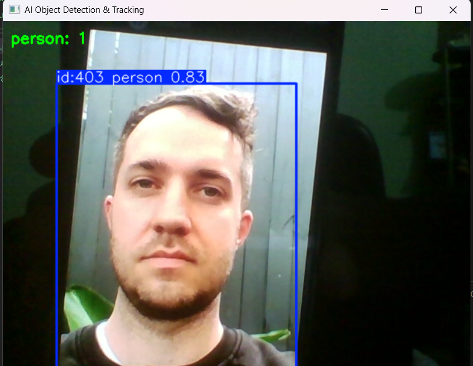
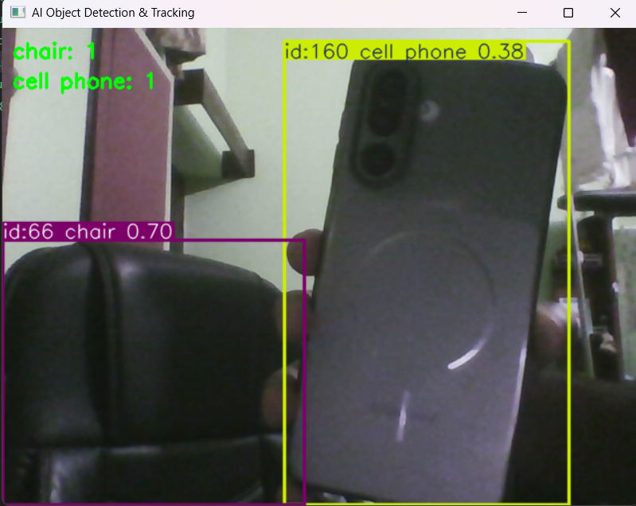

# 🎯 AI Object Detection & Tracking

A real-time AI-powered Object Detection and Tracking system built using **Python**, **OpenCV**, and **YOLOv8**.

This application uses a webcam feed to detect, classify, and track multiple objects simultaneously while assigning unique tracking IDs and displaying object counts in real time.

Developed as part of the **CodeAlpha Artificial Intelligence Internship Program**.

---

# 🚀 Live Demo

▶️ Run locally using:

```bash
python app.py
```

---

# ✨ Features

✅ Real-Time Object Detection

✅ Multi-Object Tracking

✅ Unique Tracking IDs

✅ Live Webcam Processing

✅ Object Counting

✅ Bounding Box Visualization

✅ Confidence Score Display

✅ Lightweight YOLOv8 Model

✅ Screenshot Capture Support

---

# 📸 Screenshots

## Object Tracking Example



The system assigns a unique tracking ID to each detected object and continues tracking it across multiple frames.

---

## Object Detection Example



The model detects and classifies multiple objects such as chairs, cell phones, laptops, persons, and more in real time.

---

# 🛠️ Tech Stack

| Technology  | Purpose                   |
| ----------- | ------------------------- |
| Python      | Core Programming Language |
| OpenCV      | Webcam & Video Processing |
| YOLOv8      | Object Detection Model    |
| Ultralytics | YOLO Framework            |
| NumPy       | Numerical Operations      |

---

# 🧠 AI Concepts Used

### Object Detection

The system identifies and localizes objects present in each video frame using YOLOv8.

### Object Classification

Detected objects are classified into predefined categories such as:

* Person
* Chair
* Cell Phone
* Laptop
* Bottle
* Car
* Dog
* And many more

### Object Tracking

The tracking module assigns unique IDs to detected objects and follows them across consecutive frames.

Example:

```text
id:403 person 0.83
id:160 cell phone 0.38
id:66 chair 0.70
```

---

# 📂 Project Structure

```text
CodeAlpha_ObjectDetectionTracking/
│
├── app.py
├── requirements.txt
├── README.md
│
├── assets/
│   ├── detection.png
│   └── tracking.png
│
└── models/
    └── yolov8n.pt
```

---

# ⚙️ Installation

## 1️⃣ Clone Repository

```bash
git clone https://github.com/AkarshKumar1/CodeAlpha_ObjectDetectionTracking.git
```

---

## 2️⃣ Navigate to Project Folder

```bash
cd CodeAlpha_ObjectDetectionTracking
```

---

## 3️⃣ Install Dependencies

```bash
pip install -r requirements.txt
```

---

## 4️⃣ Run Application

```bash
python app.py
```

The webcam will automatically open and start detecting objects.

---

# 📦 Dependencies

```txt
ultralytics
opencv-python
numpy
pandas
```

---

# 🔄 How It Works

### Step 1

The webcam captures live video frames.

### Step 2

YOLOv8 processes each frame and identifies objects.

### Step 3

Bounding boxes are drawn around detected objects.

### Step 4

The tracker assigns a unique ID to each object.

### Step 5

Object counts and confidence scores are displayed.

### Step 6

The processed video is shown in real time.

---

# 🎯 Supported Objects

The YOLOv8 model can detect over **80 object categories**, including:

* Person
* Cell Phone
* Laptop
* Chair
* Bottle
* Keyboard
* Mouse
* TV
* Car
* Bicycle
* Dog
* Cat

and many more.

---

# 📈 Performance

### Model Used

```text
YOLOv8n (Nano)
```

### Advantages

* Fast inference speed
* Lightweight model size
* Real-time performance
* Low memory consumption

---

# 🔮 Future Improvements

* Video File Processing
* Detection History Logging
* Object Counting Dashboard
* Detection Statistics
* Email Alert System
* Face Recognition Integration
* Streamlit Web Interface
* Cloud Deployment

---

# 📚 Learning Outcomes

Through this project I gained practical experience with:

* Computer Vision
* Deep Learning Applications
* Object Detection Systems
* Object Tracking Algorithms
* OpenCV Development
* Real-Time Video Processing
* YOLOv8 Framework
* AI Model Integration

---

# 🏆 Internship Information

### Organization

CodeAlpha

### Domain

Artificial Intelligence

### Task

Object Detection and Tracking

### Status

Completed Successfully ✅

---

# 👨‍💻 Author

## Akarsh Kumar

B.Tech Student | AI & Data Science Enthusiast

🔗 GitHub: https://github.com/AkarshKumar1

🔗 LinkedIn: https://linkedin.com/in/akarshkumar06/

---

# ⭐ Support

If you found this project useful, consider giving it a ⭐ on GitHub.

Your support motivates further development and future AI projects.

---

## 📜 License

This project is developed for educational and internship purposes.

Feel free to fork, modify, and learn from it.
